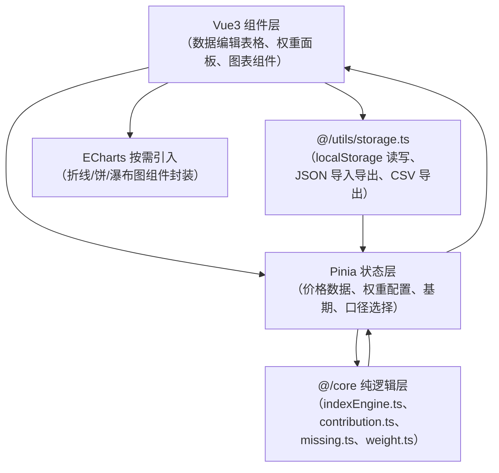

## 1. 架构设计

纯前端单页应用，所有计算与存储在浏览器本地完成，无需后端服务。核心逻辑与 UI 完全解耦：纯函数式的指数计算模块独立于 Vue 组件，便于单元测试与结果核对。



## 2. 技术选型

- **前端框架**：Vue 3 + `<script setup lang="ts">` + TypeScript 5
- **构建工具**：Vite 5，开发服务器端口 `7259`
- **样式方案**：TailwindCSS 3 + 少量自定义 CSS 变量
- **状态管理**：Pinia（替代 Vuex，轻量且 TS 友好）
- **图表库**：ECharts 5（按需引入 Line / Pie / Bar / Custom 系列，体积可控，瀑布图通过 Custom 实现）
- **图标库**：lucide-vue-next
- **数据校验**：纯函数断言，无第三方校验库
- **持久化**：localStorage（JSON 序列化） + File API（导入/导出）

## 3. 模块与文件结构

```
src/
├── core/                        # 纯逻辑层，与框架解耦
│   ├── types.ts                 # 核心类型定义
│   ├── weight.ts                # 权重计算、归一化、交易额份额
│   ├── indexEngine.ts           # 拉氏/帕氏、定基/环比/链式指数计算
│   ├── contribution.ts          # 涨跌贡献分解
│   ├── missing.ts               # 缺失值插补、剔除、异常跳变检测
│   └── verify.ts                # 结果校验（链式=定基、贡献和、权重和）
├── data/
│   └── sampleData.ts            # 内置多品类多期样例数据
├── store/
│   └── indexStore.ts            # Pinia store：聚合状态与计算属性
├── components/
│   ├── DataTable.vue            # 价格数据编辑表格
│   ├── WeightPanel.vue          # 权重配置面板（滑块+输入）
│   ├── Toolbar.vue              # 顶部工具栏（基期、口径、导入导出）
│   ├── IndexCards.vue           # 指数数值展示卡片
│   ├── IndexTrendChart.vue      # 综合指数走势（拉氏/帕氏叠加）
│   ├── NormalizedChart.vue      # 各品类归一化价格走势
│   ├── WeightChart.vue          # 权重构成图（饼/条形可切换）
│   ├── ContributionWaterfall.vue # 涨跌贡献瀑布图
│   └── VerifyPanel.vue          # 校验信息展示
├── utils/
│   ├── storage.ts               # localStorage 读写
│   ├── io.ts                    # JSON 导入导出、CSV 导出
│   └── format.ts                # 数字格式化、日期期次工具
├── App.vue
├── main.ts
└── style.css
```

## 4. 核心数据模型

```mermaid
classDiagram
    class PriceRecord {
        +string categoryId
        +string categoryName
        +string unit
        +Map~string, number|null~ prices  // key=periodId
    }
    class Period {
        +string id
        +string label  // 如 "2024-上旬1"
        +Date startDate
    }
    class WeightConfig {
        +Map~string, number~ manualWeights   // categoryId -> weight
        +Map~string, number~ turnoverShares // categoryId -> 交易额
        +"manual" | "turnover" mode
    }
    class IndexConfig {
        +string basePeriodId
        +"laspeyres" | "paasche" formula
        +"fixed_base" | "chain" | "mom" indexType
    }
    class IndexResult {
        +Map~string, number~ fixedBase  // periodId -> 定基指数
        +Map~string, number~ mom        // periodId -> 环比指数
        +Map~string, number~ chained    // periodId -> 链式指数
        +Map~string, Map~string, number~~ contributions // periodId -> categoryId -> 贡献百分点
    }
```



## 5. 核心算法要点

| 模块 | 算法 |
|------|------|
| 拉氏定基指数 | $I_t^L = \frac{\sum w_0^i \cdot (p_t^i / p_0^i)}{\sum w_0^i} \times 100$，$w_0^i$ 为基期权重 |
| 帕氏定基指数 | $I_t^P = \frac{\sum w_t^i \cdot (p_t^i / p_0^i)}{\sum w_t^i} \times 100$，$w_t^i$ 为报告期权重 |
| 环比指数 | 以上一期为临时基期，分别按拉氏/帕氏计算 |
| 链式指数 | 从基期开始逐期连乘环比指数（$I_t^{chain} = I_0 \times \prod_{k=1}^{t} I_k^{mom}$），与定基对比偏差 |
| 贡献分解 | 对拉氏：$\Delta I = \sum \frac{w_0^i}{\sum w_0} \cdot (\frac{p_t^i - p_{t-1}^i}{p_0^i}) \times 100$，每一项即品类 i 的贡献百分点 |
| 缺失值处理 | 默认线性插值，前后均缺失则剔除该品类该期并重新归一剩余权重，记录处理日志 |
| 异常跳变 | $|p_t / p_{t-1} - 1| > 阈值$（默认 30%）时标注异常，可由用户确认或修正 |
| 权重归一化 | 所有权重除以权重和，保证 $\sum w_i = 1$，缺失品类权重按剩余品类等比缩放 |

## 6. 状态管理（Pinia Store 设计）

Store 暴露以下响应式状态与 action：

- `state`: `periods[]`、`categories[]`、`priceMatrix`、`weightConfig`、`indexConfig`、`selectedPeriodId`
- `getters`: `basePeriod`、`weightNormalized`、`indexResult`（依赖 core 模块实时计算）、`contributionForSelectedPeriod`
- `actions`: `setBasePeriod()`、`setFormula()`、`updatePrice()`、`updateWeight()`、`addCategory()`、`removeCategory()`、`addPeriod()`、`removePeriod()`、`importJSON()`、`exportJSON()`、`exportCSV()`、`loadFromStorage()`、`saveToStorage()`

所有 getters 基于纯函数计算，结果可预测、可复现。
