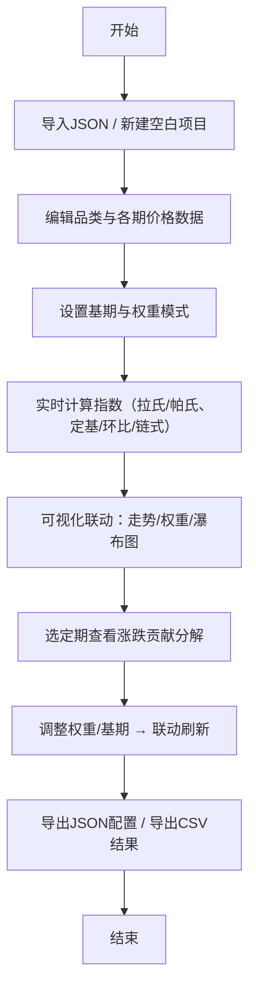

## 1. 产品概述

行业价格指数监测与编制工具，面向行业分析师和数据发布人员，用于多品类生产资料（钢材、有色金属、化工原料、煤炭等）的价格数据管理、综合指数计算、涨跌贡献分解与可视化分析。

- 核心目标：提供严谨的指数编制方法（拉氏/帕氏加权、定基/环比/链式）、可交互的权重调整、实时的贡献分解与多维度可视化，帮助用户快速生成可对外发布的价格指数。
- 目标价值：将复杂的指数编制方法论产品化，降低使用门槛，保证计算结果可复现、可追溯、可核对。

## 2. 核心功能

### 2.1 用户角色

| 角色 | 注册方式 | 核心权限 |
|------|----------|----------|
| 分析师用户 | 无需注册，本地使用 | 数据录入、指数配置、权重调整、可视化分析、结果导出 |

### 2.2 功能模块

1. **数据管理面板**：多品类多期价格数据的表格编辑、缺失值标记、异常跳变标注、品类篮子增删。
2. **指数编制引擎**：拉氏指数（固定基期权重）、帕氏指数（报告期权重）、定基指数、环比指数、链式指数（环比连乘），权重支持交易额份额与手动调整两种模式。
3. **涨跌贡献分解**：选定报告期相对基期/上期的涨跌，按品类拆解为各品类贡献的百分点，验证贡献之和等于总涨跌。
4. **可视化看板**：综合指数走势（拉氏/帕氏叠加对比）、各品类归一化价格走势、篮子权重构成（饼图/条形图）、涨跌贡献瀑布图，全部联动刷新。
5. **配置与数据持久化**：浏览器本地存储（localStorage）、JSON 导入/导出、指数结果 CSV 导出。

### 2.3 页面详情

| 页面名称 | 模块名称 | 功能描述 |
|----------|----------|----------|
| 主工作台 | 顶部工具栏 | 基期选择、编制口径切换（拉氏/帕氏）、指数类型切换（定基/环比）、数据导入导出按钮 |
| 主工作台 | 指数数值卡片 | 展示当前选定报告期的综合指数值、涨跌幅、与上期对比 |
| 主工作台 | 数据编辑表格 | 行=品类，列=期次，支持单元格编辑、缺失值标记、异常值高亮、品类/期次增删 |
| 主工作台 | 权重配置面板 | 各品类权重滑块/输入框、手动/交易份额权重模式切换、实时归一化显示 |
| 主工作台 | 综合指数走势图 | 折线图，时间轴为期次，可叠加拉氏/帕氏两条线，悬停显示数值，点击选定期 |
| 主工作台 | 品类归一化走势图 | 多折线图，各品类价格以基期=100 归一化 |
| 主工作台 | 权重构成图 | 饼图或水平条形图，展示当前篮子权重分布 |
| 主工作台 | 涨跌贡献瀑布图 | 瀑布图，展示选定期相对上期的各品类涨跌贡献，正负区分 |
| 主工作台 | 校验信息区 | 展示链式环比连乘与定基指数的偏差、贡献和校验、权重和校验等核对信息 |

## 3. 核心流程

用户从空白或导入已有 JSON 开始：录入/编辑各品类各期价格 → 设置基期与权重模式（或手动调权重）→ 实时计算拉氏/帕氏定基/环比/链式指数 → 在走势图上选定期查看该期涨跌贡献瀑布 → 调整权重或基期后所有图表联动刷新 → 导出 JSON 配置与数据或导出 CSV 结果。

## 4. 用户界面设计

### 4.1 设计风格

- **主色调**：深蓝灰 `#1e293b` 背景 + 深青蓝 `#0ea5e9` 作为上涨主色 + 暖橙红 `#f97316` 作为下跌色，中性色采用 slate 灰阶。
- **辅色调**：各品类使用离散的高辨识度配色（从 Tableau 10 调色板衍生）。
- **按钮风格**：圆角 6px，细边框，hover 时轻微上浮与背景加深，按下时内凹。
- **字体**：数据展示使用等宽字体 `JetBrains Mono`，正文使用 `Inter` 类无衬线字体。
- **布局风格**：卡片式栅格布局，顶部工具栏通栏，下方左侧为数据与权重编辑面板，右侧为可视化看板（2×2 图表网格）。
- **图标风格**：简洁线性图标（lucide-vue-next）。

### 4.2 页面设计概述

| 页面名称 | 模块名称 | UI 元素 |
|----------|----------|----------|
| 主工作台 | 顶部工具栏 | 深色通栏，左侧项目名称，中部基期下拉 + 口径切换分段控件 + 指数类型切换，右侧导入/导出按钮组 |
| 主工作台 | 指数数值卡片 | 大号等宽字体显示指数值，下方小字涨跌幅与红绿箭头，左右对比上期 |
| 主工作台 | 数据编辑表格 | 斑马纹行，缺失值浅灰斜体，异常值红色边框，支持右键菜单插入/删除行列 |
| 主工作台 | 权重配置面板 | 每个品类一行：颜色圆点 + 名称 + 滑块 + 数字输入框 + 百分比显示，底部归一和校验 |
| 主工作台 | 综合指数走势图 | 深色背景图表，网格线弱化，拉氏/帕氏双折线图例可勾选 |
| 主工作台 | 品类归一化走势图 | 多色折线，图例可筛选品类 |
| 主工作台 | 权重构成图 | 环形饼图，扇区悬停高亮 |
| 主工作台 | 涨跌贡献瀑布图 | 上涨柱青色、下跌柱橙色、累计柱深灰，柱顶标注百分点 |
| 主工作台 | 校验信息区 | 小型卡片，绿色勾选 / 黄色警告图标 + 文案，展示核对结果 |

### 4.3 响应式

以桌面端（≥1280px）为主设计，≥1024px 保持双栏布局，移动端降为单栏堆叠，表格可横向滚动。优先保证桌面端数据密度与交互流畅。
